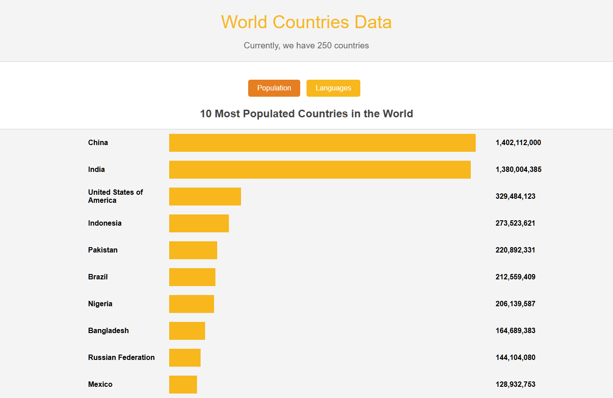
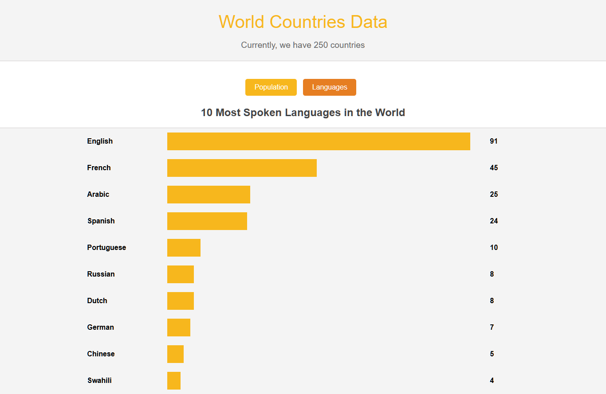
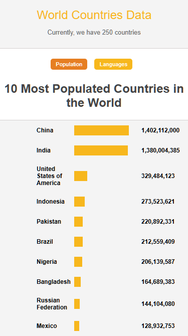

# World Countries Data Visualization App 🌍

## Description
The **World Countries Data Visualization App** is a data-driven application that displays key insights about countries from around the world. The app allows users to visualize the **10 most populated countries** and the **10 most spoken languages** using an interactive bar chart. Users can toggle between population and language data for a clearer understanding of global trends.

## Technologies Used
- **TypeScript**: For type safety and enhanced JavaScript development.
- **HTML**: For structuring the content of the application.
- **CSS**: For styling, responsive layout, and making the application visually appealing.
- **JavaScript**: For dynamically fetching and rendering country data and handling user interactions.

## Features
- **Top 10 Most Populated Countries**: View the countries with the highest populations, rendered as a bar chart.
- **Top 10 Most Spoken Languages**: See the most widely spoken languages across countries, also visualized in a bar chart.
- **Interactive UI**: Toggle between population and language charts using buttons.
- **Responsive Design**: The application is fully responsive and adapts to different screen sizes for a smooth user experience on both desktop and mobile devices.

## Live Demo
Check out the live version of the app here: [Live Site](https://world-countries-data-visualisation-kgl4awegl.vercel.app/)

## Repository
Access the project repository here: [GitHub Repository](https://github.com/ezekiel673/world_countries_data_visualisation)

## Screenshots
### 1. Main View: 10 Most Populated Countries

*Shows the top 10 most populated countries in the world.*

### 2. Toggling to 10 Most Spoken Languages

*Shows the top 10 most spoken languages across countries.*

### 3. Mobile View

*Responsive layout of the app on a mobile device.*

## How to Use
1. **Toggle Between Charts**: Use the buttons labeled **Population** and **Languages** to switch between the two visualizations.
2. **Interactive Bar Chart**: Each bar represents the data, and the length of the bar is proportional to the value (population or language count).
3. **Responsive Experience**: The app adjusts its layout based on the screen size, ensuring usability on different devices.


## Setup and Installation
1. Clone the repository:
   ```bash
   git clone https://github.com/your-username/world-countries-data-visualization.git
   ```
2. Navigate to the project directory:
    ```bash
    cd world-countries-data-visualization
    ```
3. Install dependencies (if applicable):
    ```bash
    npm install
    ```
4. Run the app locally:
    ```bash
    npm start
    ```

## How to Use
- Visit the homepage to view a list of countries.
- Use the search and filter options to find specific countries.
- Click on a country to view detailed information about it.
- The app is designed to be user-friendly and responsive, ensuring a smooth experience across various devices.

## License
- This project is licensed under the MIT License - see the [License](LICENSE) file for details.

## Acknowledgements
[REST Countries API](https://restcountries.com/) for providing the data.
